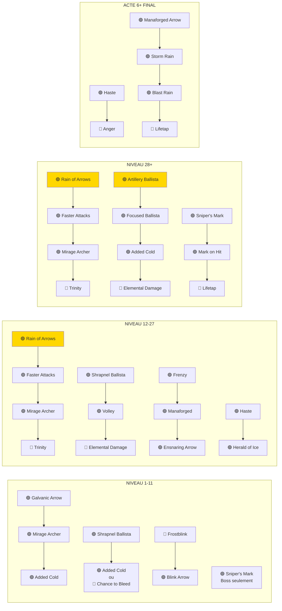
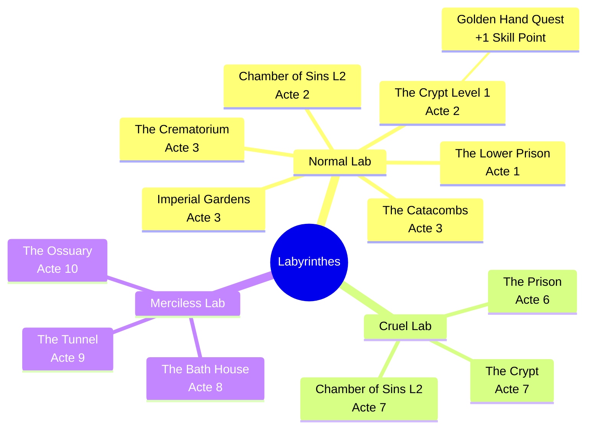
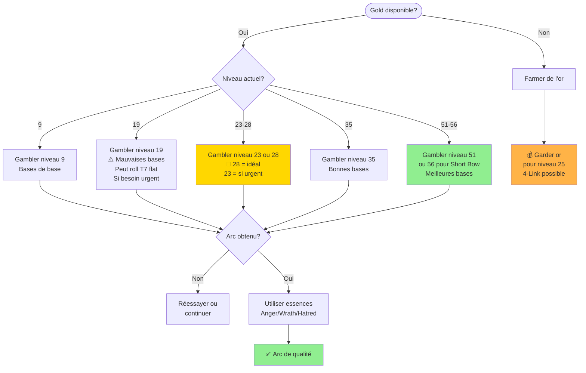

# Guide de Leveling - Lightning Arrow / Elemental Hit Deadeye
## Visualisation Mermaid

### Progression du Leveling - Vue d'ensemble

```mermaid
flowchart TD
    Start([Début - Niveau 1]) --> Phase1[NIVEAU 1-11<br/>Acte 1]
    
    Phase1 --> Buy1[Achats:<br/>🟢 Sniper's Mark lvl 4<br/>🔵 Frostblink lvl 4<br/>⚠️ NE PAS level Frostblink]
    Buy1 --> Gems1[Setup Gemmes:<br/>🟢 Galvanic Arrow<br/>🟢 Shrapnel Ballista]
    
    Gems1 --> Quest1[📦 Strongbox Prison<br/>🔶 Aider Alira<br/>📜 Great White Beast]
    
    Quest1 --> Phase2[NIVEAU 12-27<br/>Acte 2 et 3]
    
    Phase2 --> Swap1[🔄 CHANGEMENT MAJEUR<br/>Galvanic → Rain of Arrows]
    Swap1 --> Buy2[Achats:<br/>🔴 Anger lvl 24]
    Buy2 --> Craft1[Craft après Vaal Oversoul:<br/>Vitesse déplacement bottes]
    Craft1 --> Craft2[Craft après Piété:<br/>Dégâts foudre arc<br/>Dégâts élé anneaux]
    
    Craft2 --> Gems2[Nouvelles gemmes:<br/>🟢 Frenzy lvl 16<br/>🟢 Blood Rage lvl 16<br/>🟢 Herald of Ice lvl 16]
    
    Gems2 --> Phase3[NIVEAU 28<br/>Acte 3 et 4]
    
    Phase3 --> Swap2[🔄 CHANGEMENT MAJEUR<br/>Shrapnel → Artillery Ballista]
    Swap2 --> Recipe[🔶 Recette Hyrri's Bite<br/>optionnel]
    Recipe --> Lab1[⚔️ Labyrinth Normal<br/>6 emplacements possibles]
    
    Lab1 --> Gems3[Nouvelles gemmes:<br/>🟢 Mark on Hit<br/>🔴 Lifetap<br/>🟢 Focused Ballista lvl 31]
    
    Gems3 --> Phase4[ACTE 6+<br/>Déblocage Lily]
    
    Phase4 --> Final[Setup Final:<br/>🟢 Rain of Arrows<br/>🟢 Artillery Ballista<br/>🟢 Haste + 🔴 Anger]
    
    Final --> Act5[Acte 5:<br/>🔵 Jade Flask]
    Act5 --> End([Fin Campagne<br/>Tuer Kitava Acte 10])
    
    style Start fill:#90EE90
    style End fill:#FFB6C1
    style Phase1 fill:#87CEEB
    style Phase2 fill:#87CEEB
    style Phase3 fill:#87CEEB
    style Phase4 fill:#87CEEB
    style Swap1 fill:#FFD700
    style Swap2 fill:#FFD700
    style Quest1 fill:#DDA0DD
    style Lab1 fill:#FF6347
```

---

### Timeline des Niveaux et Changements Critiques

```mermaid
gantt
    title Progression Leveling Lightning Arrow Deadeye
    dateFormat X
    axisFormat %s
    
    section Acte 1
    Niveau 1-11 Galvanic Arrow : 1, 11
    Achats Sniper's Mark & Frostblink : milestone, 4, 0
    Shrapnel Ballista : 4, 11
    Added Cold : 8, 11
    Blink Arrow : 10, 11
    Strongbox Prison (2nd Quicksilver) : milestone, 10, 0
    
    section Acte 2-3
    Niveau 12-27 Rain of Arrows : 12, 27
    SWAP: Galvanic → Rain of Arrows : crit, 12, 0
    Manaforged & Frenzy : 16, 27
    Blood Rage & Herald of Ice : 16, 27
    Elemental Damage with Attacks : 18, 27
    Haste disponible : milestone, 24, 0
    Anger disponible : milestone, 24, 0
    
    section Acte 3-4
    Niveau 28+ Artillery Ballista : 28, 40
    SWAP: Shrapnel → Artillery : crit, 28, 0
    Focused Ballista : 31, 40
    Labyrinth Normal : milestone, 33, 0
    
    section Acte 5-6+
    Setup Final Rain of Arrows : 40, 68
    Déblocage Lily Roth : milestone, 40, 0
    Jade Flask (Acte 5) : milestone, 45, 0
    
    section Fin Campagne
    Acte 7-10 : 50, 68
    Kitava Acte 10 : milestone, 68, 0
```

---

### Configuration des Gemmes par Phase

---

### Checklist des Étapes Critiques

```mermaid
flowchart LR
    subgraph "Acte 1"
        A1{{Anneau de fer}}
        A2{{Carquois Serrated}}
        A3{{Vitesse déplacement bottes}}
        A4{{Strongbox Prison}}
        A5{{Aider Alira}}
    end
    
    subgraph "Acte 2-3"
        B1{{Craft vitesse bottes<br/>après Vaal}}
        B2{{Craft arc après Piété}}
        B3{{Craft anneaux après Piété}}
        B4{{Acheter Anger}}
    end
    
    subgraph "Acte 3-4"
        C1{{Lab Normal<br/>6 emplacements}}
        C2{{Recette Hyrri's Bite<br/>optionnel}}
        C3{{Swap Artillery}}
    end
    
    subgraph "Acte 5-6+"
        D1{{Jade Flask<br/>Acte 5}}
        D2{{Débloquer Lily}}
        D3{{Setup Final}}
    end
    
    subgraph "Acte 10"
        E1{{Tuer Kitava}}
        E2{{Passer au build LA endgame}}
    end
    
    A1 --> A2 --> A3 --> A4 --> A5
    A5 --> B1 --> B2 --> B3 --> B4
    B4 --> C1 --> C2 --> C3
    C3 --> D1 --> D2 --> D3
    D3 --> E1 --> E2
    
    style A4 fill:#FFB347
    style A5 fill:#FFB347
    style C1 fill:#FF6347
    style D1 fill:#87CEEB
    style E1 fill:#FF6347
    style E2 fill:#90EE90
```

---

### Emplacements des Labyrinthes

---

### Gambling - Niveaux Optimaux pour Arcs

---

## Légende des Couleurs

- 🟢 **Vert** = Gemmes de Dextérité (Dex)
- 🔵 **Bleu** = Gemmes d'Intelligence (Int)
- 🔴 **Rouge** = Gemmes de Force (Str)
- ⚠️ **Attention** = Points critiques
- 🔄 **Changement** = Swap majeur de setup
- 📦 **Coffre/Loot** = Strongbox ou récompenses
- 🔶 **Quête** = Objectif de quête important
- ⚔️ **Combat** = Boss ou Labyrinth
- 💰 **Or** = Gambling ou crafting
